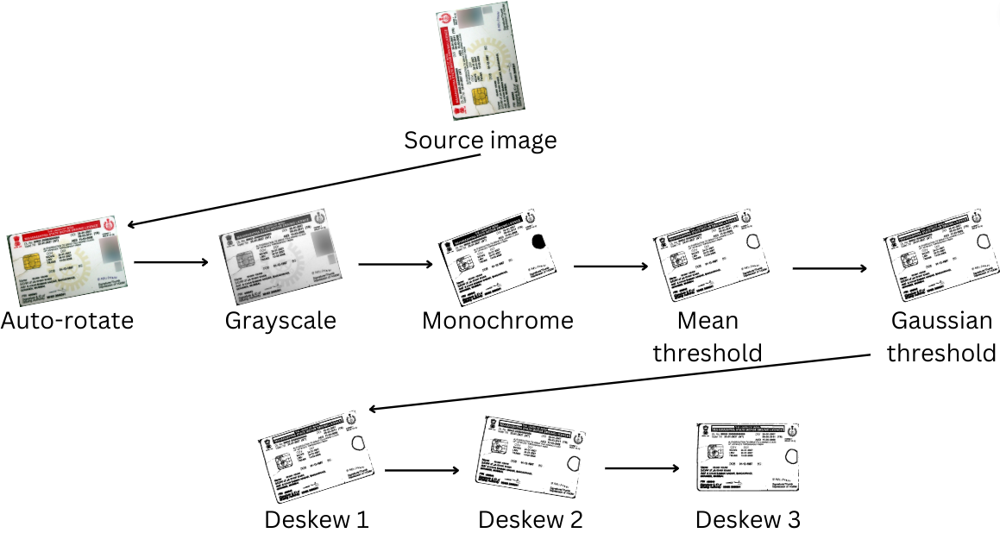

```⠀⠀⠀⠀⠀⠀⠀⠀⠀⠀⠀⠀⠀⠀⠀⠀⠀⠀⠀⠀⠀⠀⠀⠀⠀⠀⠀⠀⠀⠀⠀⠀⠀⠀⠀⠀⠀⠀⠀⠀⠀⠀⠀⠀⠀⠀⠀⠀⠀⠀⠀⠀⠀⠀⠀⠀⠀⠀⠀⠀⠀⠀⠀⠀⠀⠀⠀⠀⠀⠀⠀⠀
⠀⠀⠀⠀⠀⠀⠀⣤⣤⣄⣀⡀⠀⠀⠀⢀⣠⣤⣤⣄⡀⠀⠀⠀⢀⣀⣠⣤⣤⠀⠀⠀⠀⠀⠀⠀⠀⠀
⠀⠀⠀⠀⠀⠀⠸⣿⣿⡿⠿⢿⣷⡄⢠⣿⣿⣿⣿⣿⣿⡄⢀⣾⡿⠿⢿⣿⣿⠇⠀⠀⠀⠀⠀⠀⠀⠀
⠀⠀⠀⠀⠀⠀⠀⠈⠉⠀⠀⢸⣿⡇⢸⣿⣿⣿⣿⣿⣿⡇⢸⣿⡇⠀⠀⠉⠁⠀⠀⠀⠀⠀⠀⠀⠀⠀
⠀⣠⣤⡀⠀⠀⠀⠀⠀⠀⠀⢸⣿⡇⢸⣿⣿⣿⣿⣿⣿⡇⢸⣿⡇⠀⠀⠀⠀⠀⠀⠀⢀⣤⣄⠀⠀⠀
⠸⣿⣿⣿⣿⣿⣿⣿⣿⣦⠀⢸⣿⡇⢸⣿⣿⣿⣿⣿⣿⡇⢸⣿⡇⠀⣴⣿⣿⣿⣿⣿⣿⣿⣿⠇⠀⠀
⠀⠉⠉⠁⠀⠀⠀⠀⣿⣿⠀⢸⣿⡇⠀⠉⣿⣿⣿⣿⠉⠀⢸⣿⡇⠀⣿⣿⠀⠀⠀⠀⠈⠉⠉⠀⠀⠀                O C T O P I I
⠀⠀⠀⠀⠀⠀⠀⠀⣿⣿⣀⣈⣻⣿⣿⣿⣿⣿⣿⣿⣿⣿⣿⣟⣁⣀⣿⣿⠀⠀⠀⠀⠀⠀⠀⠀⠀⠀       
⠀⠀⠀⠀⠀⠀⠀⠀⠘⠿⠿⠿⠿⠿⣿⣿⣿⣿⣿⣿⣿⣿⠿⠿⠿⠿⠿⠃⠀⠀⠀⠀⠀⠀⠀⠀⠀⠀(c) Copyright 2022 RedHunt Labs Private Limited
⠀⠀⠀⠀⠀⠀⢀⣤⣤⣤⣤⣤⣤⣴⣿⣿⣿⡇⢸⣿⡿⣿⣦⣤⣤⣤⣤⣤⣤⡀⠀⠀⠀⠀⠀⠀⠀⠀
⠀⠀⠀⠀⠀⠀⢸⣿⠋⠉⠉⠉⠉⠉⠉⢸⣿⡇⢸⣿⡇⠈⠉⠉⠉⠉⠉⠙⣿⣧⠀⠀⠀⠀⠀⠀⠀⠀
⠀⠀⠀⠀⠀⢰⣿⣿⣦⠀⢰⣿⣿⣦⠀⢸⣿⡇⢸⣿⡇⠀⣰⣿⣿⡆⠀⣴⣿⣿⡆⠀⠀⠀⠀⠀⠀⠀
⠀⠀⠀⠀⠀⠈⠻⠿⠋⠀⠘⣿⣿⠃⠀⢸⣿⡇⢸⣿⡇⠀⠘⣿⣿⠃⠀⠙⠿⠟⠁⠀⠀⠀⠀⠀⠀⠀
⠀⠀⠀⠀⠀⠀⠀⠀⠀⠀⠀⢻⣿⣦⣤⣼⣿⠃⠘⣿⣧⣄⣤⣿⡟⠀⠀⠀⠀⠀⠀⠀⠀⠀⠀⠀⠀⠀
⠀⠀⠀⠀⠀⠀⠀⠀⠀⠀⠀⠀⠉⠛⠛⠛⠁⠀⠀⠈⠛⠛⠛⠋⠀⠀⠀⠀⠀⠀⠀⠀⠀⠀⠀⠀⠀⠀
```


# Octopii

Octopii is an open-source Personal Identifiable Information (PII) scanner that uses Optical Character Recognition (OCR), regular expression lists and Natural Language Processing (NLP) to search for Government ID, addresses, emails etc in images, PDFs and documents in exposed locations.

## Usage
### Installing dependencies
1. Install all dependencies via `pip install -r requirements.txt`.
2. Install the Tesseract helper locally via `sudo apt install tesseract-ocr -y` on Ubuntu or `sudo pacman -Syu tesseract` on Arch Linux.
3. Install Spacy language definitions locally via `python -m spacy download en_core_web_sm`.

Once you've installed the above, you're all set to use Octopii.

### Running

To run, type

```
python3 octopii.py <location to scan>
```
_where `<location to scan>` is a file or a directory._

Octopii currently supports local scanning via filesystem path, and S3 directory scanning and open directory listing scanning via URLs. You can also supply individual image URLs or files as an argument.

### Example

The `dummy-pii/` folder contains a bunch of sample PII for you to test Octopii on. Passing it as an argument results in the output below

```
owais@artemis ~ $ python3 octopii.py dummy-pii/

Searching for PII in dummy-pii/dummy-drivers-license-nebraska-us.jpg
{
    "file_path": "dummy-pii/dummy-drivers-license-nebraska-us.jpg",
    "pii_class": "Nebraska Driver's License",
    "country_of_origin": "United States",
    "identifiers": [],
    "emails": [],
    "phone_numbers": [
        "4000002170"
    ],
    "addresses": [
        "Nebraska"
    ]
}

Searching for PII in dummy-pii/dummy-PAN-India.jpg
{
    "file_path": "dummy-pii/dummy-PAN-India.jpg",
    "pii_class": "Permanent Account Number",
    "country_of_origin": "India",
    "identifiers": [],
    "emails": [],
    "phone_numbers": [],
    "addresses": [
        "INDIA"
    ]
}

...
```

A file named `output.txt` is created containing all the output printed on the console. Since scanning for images takes time, this file is appended to in real-time.

## Working

Octopii uses Tesseract's Optical Character Recognition (OCR) and NLTK's Natural Language Processing (NLP) to detect various forms of personal identifiable information that may be leaked in a public location. This is done via the following steps:

### 1. Input

Octopii can scan for images (jpg and png) and documents (pdf, doc, txt etc). It also supports 3 sources:

1. Amazon Simple Storage Service (S3): traverses S3 container URLs containing XML storage schemas and scans for files 
2. Open directory listing: traverses open directory listings such as Apache Tomcat and scans for files 
3. Local filesystem: can access files and folders within UNIX-like filesystems (macOS and Linux-based operating systems)

### 2. Importing and cleaning image(s)

Images are detected imported via Python Imaging Library (PIL) and are opened with OpenCV. They are then "cleaned" for text extraction using the following image transformation steps:

1. Auto-rotation
2. Grayscaling
3. Monochrome
4. Mean threshold
5. Gaussian threshold
6. Deskewing (thrice)

 

### 3. Performing Optical Character Recognition (OCR)

Tesseract is used to grab all text strings from an image/file. It is then tokenized into a list of strings, via newline characters ('\n') and spaces (' '). Garbled text, such as null strings and single characters are then removed from this list, resulting in an 'intelligible' list of potential words.

This list of words is then fed into a similarity checker function. This function uses Gestalt pattern matching to compare each word extracted from the PII document with a list of keywords, present in `definitions.json`. This check is applied on each cleaning attempt of a PII image. The number of times a word occurs from the keywords list is counted and this is used to derive the confidence score. When a particular definition's keywords appear frequently in this scan, it gets the highest score and is thus picked as the predicted PII class and its country of origin.

Additionally, Octopii also checks for sensitive PII substrings such as emails, phone numbers and common government ID unique identifiers using regular expressions. It can also extract geolocation data such as addresses and countries using Natural Language Processing.

## Contributing
Open-source projects like these thrive on community support. Since Octopii relies heavily on preset definitions, contributions are much appreciated. Here's how to contribute:

### 1. Fork 

Fork the official repository at https://github.com/redhuntlabs/octopii

### 2. Understand

The `definitions.json` file consists of keywords to search for during an OCR scan, as well as other miscellaneous information such as country of origin, regular expressions etc.

An item in this file looks as follows:

```
"<pii class name>" : {
      "regex" : "<a regular expression or null>",
      "region" : <the country this PII originates from or null>,
      "keywords" : [
         "<keyword 1>",
         "<keyword 2>",
         ...
      ]
   },
```

### 3. Updating definitions

Keep the following rules in mind when writing your own definitions:

- PII class: The PII class name must contain the simple, common name of the document. For example, the Indian Government issued ID card is known as "Aadhaar", so that must be the PII class.
- Regex: The regex must be as precise as possible and must only exist if the ID card's identifier has an obvious pattern. For example, an Indian Permanent Account Number (PAN) card always has five Latin characters, followed by four numbers and a final Latin character (XXXXX0000X). Thus, a good regex can be used here. Please be extra careful with this step so as to avoid false positives. You may set this to `null` if you wish.
- Country of origin: Where this PII originates from. Keep this as simple as possible and use common, shortened names. For example, "India" instead of "Republic of India". If you'd like to denote a province/state/subdivision, use the PII class field instead of this field. You may set this to `null` if you wish.
- Keywords: This is a list of prominent words in the Latin script, appearing in the document that can be picked up during OCR checks. Make sure these words are very specific to the document. Avoid using common words such as "the" or "of". For example, Indian Aadhaar cards have the words "Aadhaar", "Unique Identification" and "India" in English. These are good, unique words that generally don't appear in other documents.

### 4. Pull request

Submit a pull request from your forked repo and we'll pick it up and merge it if the changes are good.

---

## Credits

- [BeautifulSoup](https://beautiful-soup-4.readthedocs.io/en/latest/)
- [Tesseract](https://github.com/madmaze/pytesseract)
- [Keras](https://keras.io/)
- [SciKit](https://scikit-learn.org/)
- Python Image Library
- [Spaces - DigitalOcean](https://www.digitalocean.com/products/spaces)
- [Teachable Macine - Google](https://teachablemachine.withgoogle.com/) 

## License

[MIT License](LICENSE)

(c) Copyright 2023 RedHunt Labs Private Limited

Author: Owais Shaikh
